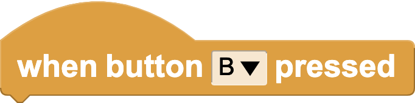
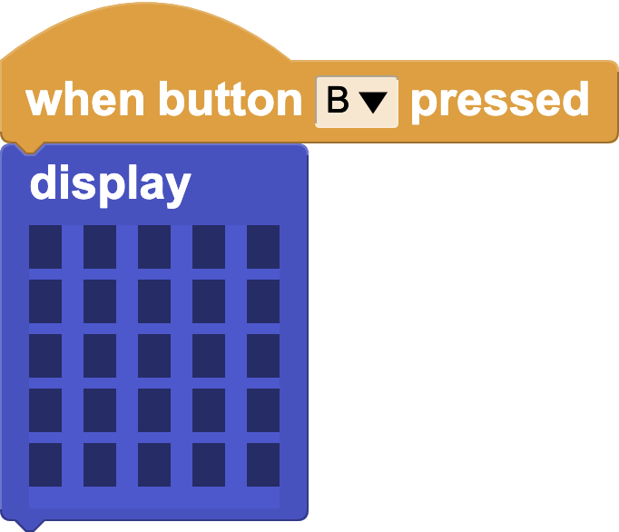
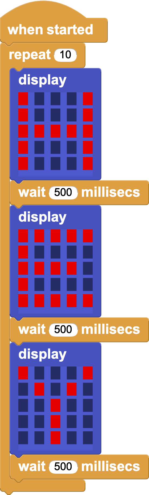
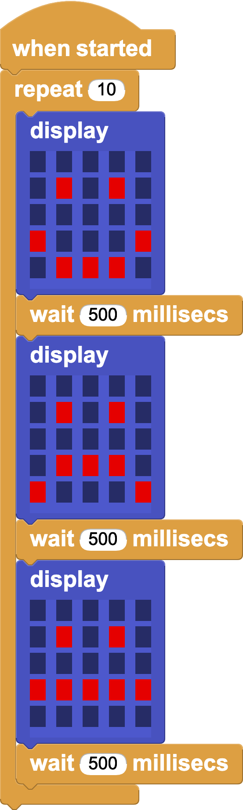
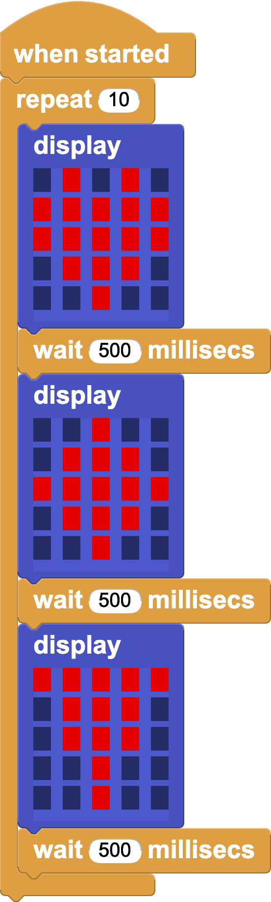
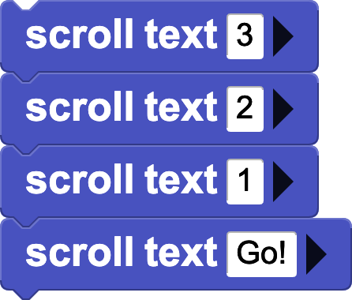

### My First Blog Entry

This is a test blog entry.

[[note]]This is a copy of the micro:bit **Getting Started** activity to test embedded scripts.
[[n/ote]]

[[fact]]
Blogging is fun!
[[/fact]]

[[safety]]
#### SAFETY NOTE
### Check spelling!!
Spelling misteaks are easy to miss.
[[/safety]]

### Connect the micro:bit

**New to MicroBlocks?** See [Get Started](https://microblocks.fun/get-started) to.

Open MicroBlocks and connect the micro:bit to your computer with a USB cable.

If running MicroBlocks in the browser, click the USB icon to connect.
The MicroBlocks desktop app will connect to the micro:bit automatically.

A green circle will appear, showing that the micro:bit is connected.

### Buttons

From *Control*, drag two **when button pressed** blocks into the scripting area.

Use the menu to change A to B in one of them.

 

Select the LED Display library.

Use these scripts to make the buttons on the micro:bit turn the LED display on and off:

 

Edit the display block by clicking on the small boxes. Click on a box and drag with the mouse down to change multiple boxes.

### Animations

Create animations of letters, numbers, shapes, and symbols using the display, wait, and repeat blocks. Can you make your name?

  

Use use the button hats to start animations. How can you control the animation speed?

### Scrolling Text

Drag the `scroll text` block into the scripting area and click the text to customize it!

You can also scroll numbers. Try this script to create a countdown!

