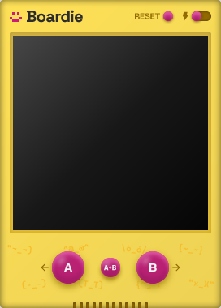
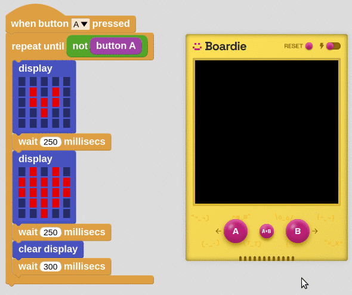
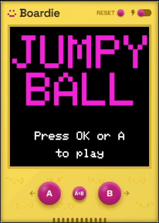
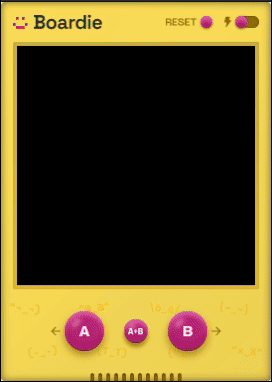
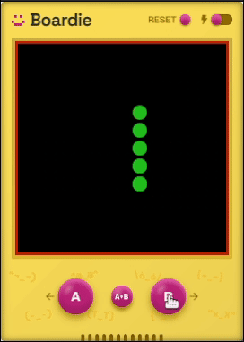
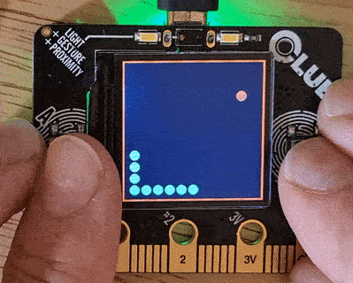

How do you give someone a hand-on introduction to MicroBlocks if they don't have a microcontroller board?

That's a problem we have encountered many times when presenting MicroBlocks at virtual workshops over the past several years. It is also a problem faced  by teachers who don't have enough boards for every student in their class.

Enter **Boardie**, a virtual board for MicroBlocks that lets people try MicroBlocks right in the browser.

The goal of Boardie is to introduce MicroBlocks to people who are thinking about physical computing but don't yet have a board. We want to help them see that coding a microcontroller is easy and fun, and encourage them dive into actual physical computing.

#### What Boardie is not

Boardie is not meant to replace a real microcontroller. The magic of physical computing arises from its ability to interact with the physical world: to sense physical phenomenon like light, sound, and temperature and to control things like lights, motors, and electrical appliances.

Boardie makes no attempt to simulate physical sensors or output devices. While is not difficult to simulate those things — for example, sliders can be used as virtual sensor inputs and animated images can show virtual motors and servos — we feel that doing that misses the point.

We want people to experience the magic, and the resulting learning, of doing physical computing in the actual physical world. 

#### What Boardie is

Boardie is a virtual board that does some of the things that actual microcontrollers can do. It has two programmable buttons, like a micro:bit, and it can emulate the 5x5 LED display of the micro:bit or the 240x240 pixel TFT display of Adafruit Clue. It can make square-wave beeps and play tunes, and it supports a simple file system. Finally, it supports the same MicroBlocks HTTP libraries that work on WiFi enabled boards.

#### Using Boardie

Boardie runs in the MicroBlocks web app at [microblocks.fun/run](microblocks.fun/run). Since it does not require WebSerial, it can run in Safari and Firefox, as well as Chrome and Edge. Boardie is not supported in the MicroBlocks stand-alone apps.

Start Boardie by clicking on the USB icon and selecting *open Boardie*. When Boardie is open, MicroBlocks is connected to it and you can program and interact with Boardie in the same way you would a real, physical device.

MicroBlocks can only be connected to one board at a time. So, since Boardie is a virtual board, you'll need to disconnect Boardie before connecting MicroBlocks to a physical board. Use the *disconnect* command in the USB icon menu or Boardie's power switch to disconnect. Boardie disappears when it is disconnected.

#### Examples

Here is a simple micro:bit example running on Boardie, the *Heartbeat* project:

Clicking the A button on Boardie runs the script.

When the Boardie device is in focus you can also use the left and right arrow keys or the A and B on your keyboard to activate the buttons. That feature is useful for for games.

Having a TFT display means we're not limited to a 5x5 matrix.  As with the Adafruit Clue, the Citilab ED1 or the M5Stack, you can draw arbitrary graphics on the screen using the MicroBlocks TFT library.

This Jumpy Ball game was originally designed for the Citilab ED1 but is coded to automatically adjust to different screen dimensions:

Boardie features a ~5MB file system that can store data or media files. This tile-matching memory game uses the MicroBlocks BMP library to display images:

You may have noticed that the Boardie TFT screen is actually a touch screen, which gives you more possibilities for UI design than just the two buttons would.

Boardie also features a speaker. The speaker grill at the bottom of the face plate glows when sound is being played:

Here's the exact same game being playing on a physical board:

We can't wait to see what you will create with Boardie!

---

#### Boardie Specs

For the more tech-oriented, here are the technical specs of this virtual board:

* RAM: 65kB
* File storage: ~5MB
* Inputs: A and B buttons, plus a combined A+B button, touch screen
* Outputs: 240x240px 24-bit TFT, speaker
* Network capabilities: HTTP Client

---

#### Acknowledgment

Many thanks to Christiane, leader of the SAP Young Thinkers group, for suggesting Boardie. We were initially skeptical, but now we love Boardie!
